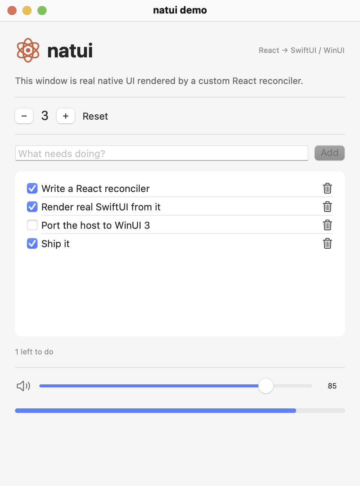

# natui

Write React TypeScript. Get **real native desktop UI**: SwiftUI on macOS, WinUI 3 on
Windows. No webview, no Electron, no Yoga, the platform's own layout engine,
controls, dark mode, and accessibility.

```tsx
import { useState } from 'react';
import { run, VStack, HStack, Text, Button, TextField } from 'natui';

function App() {
  const [count, setCount] = useState(0);
  return (
    <VStack spacing={12} padding={20} alignment="leading">
      <Text font="largeTitle" weight="bold">Hello, native</Text>
      <HStack spacing={8}>
        <Button variant="bordered" onPress={() => setCount(c => c - 1)}>−</Button>
        <Text font="title2" monospaced>{String(count)}</Text>
        <Button variant="bordered" onPress={() => setCount(c => c + 1)}>+</Button>
      </HStack>
    </VStack>
  );
}

await run(<App />, { title: 'my app', width: 480, height: 320 });
```

That `<VStack>` is a real SwiftUI `VStack` in a real `NSWindow` (and a WinUI grid
stack on Windows). `useState`, keys, conditional rendering, effects, all of React
works, because this *is* React (19) driving a custom renderer.

<p align="center"></p>

## How it works

```
React 19 ── react-reconciler 0.33 ── shadow tree ── NDJSON ops ──► native host
                                                    ◄── events ──  (SwiftUI / WinUI 3)
```

A custom reconciler batches each React commit into one atomic op batch and streams
it to a tiny native host process (~1k lines per platform) that materializes the
tree with the platform's own declarative UI framework. Events stream back and run
your handlers at React's interactive priorities. Controlled inputs stay glitch-free
under latency via protocol-level echo suppression (seq/ack).

Full details: [docs/architecture.md](docs/architecture.md) ·
wire protocol: [docs/protocol.md](docs/protocol.md)

## Try it (macOS)

Prerequisites: macOS 14+, Xcode command line tools with a Swift 6 toolchain,
Node.js 22+, pnpm 11 (`corepack enable`).

```bash
pnpm install
pnpm build:host:macos        # swift build -c release --package-path hosts/macos
pnpm demo                    # builds the package, opens the native demo window
```

Automated end-to-end verification (drives the real SwiftUI window via the debug
protocol: tree dumps, real optimistic edits, host-rendered screenshots, plus a
controlled-input stress phase exercising native seq/ack):

```bash
pnpm verify
```

Contract and unit tests, typecheck, package build (no GUI needed):

```bash
pnpm test && pnpm typecheck && pnpm build
```

## Windows

`hosts/windows/NatuiHost` implements the same protocol as a WinUI 3 unpackaged
self-contained app. It was written on macOS and needs a first compile pass on a
Windows machine, see `hosts/windows/NatuiHost/README.md`.

```powershell
dotnet build hosts/windows/NatuiHost -p:Platform=x64
pnpm demo   # locate.ts finds the exe; or set NATUI_HOST
```

## Components (POC set)

`VStack` `HStack` `ZStack` `Spacer` `Divider` `ScrollView` `List` `Text` `Image`
`ProgressView` `Button` `TextField` `Toggle` `Slider` `Picker`, typed props,
shared across platforms (see [docs/protocol.md](docs/protocol.md) for the mapping
table). Common props include accessibility basics (`accessibilityLabel`,
`accessibilityHint`, `accessibilityIdentifier`), mapped to the platform's AX
attributes.

## Single-process mode (no Node at runtime)

The host can evaluate the React bundle **in-process with JavaScriptCore**, so
the shipped app is one native process with zero Node at runtime.

```bash
pnpm build                                                 # emit packages/natui/dist first
cd examples/demo
pnpm build:embedded                                        # esbuild -> dist/embedded.js
../../hosts/macos/.build/release/natui-host --bundle dist/embedded.js
```

Automated proof (mount + interactions + screenshot + a closed-stdin lifecycle
regression, driven over the debug port):

```bash
pnpm verify:embedded
```

## Status

Experimental proof of concept. What the automated checks demonstrate today, on
macOS: 31 contract/unit tests cover the reconciler-host op semantics (keyed
moves, seq/ack echo suppression, controlled-value enforcement for every input
kind including Slider, prop validation, startup handshake, screenshot
failure/timeout handling), and two end-to-end suites drive the real SwiftUI
window, one in Node dev mode and one in embedded-JSC single-process mode, both
asserting against native tree dumps and validating the PNGs they capture; the
embedded suite additionally pins the native seq/ack contract deterministically
by injecting stale and current acks over the wire. The
Windows host is written to the same protocol but has not yet been compiled on a
Windows machine; treat it as unverified source. See
[docs/architecture.md](docs/architecture.md) for the staged packaging path
(bun sidecar, then in-process JavaScriptCore / Hermes).

## License

MIT, see [LICENSE](LICENSE).
